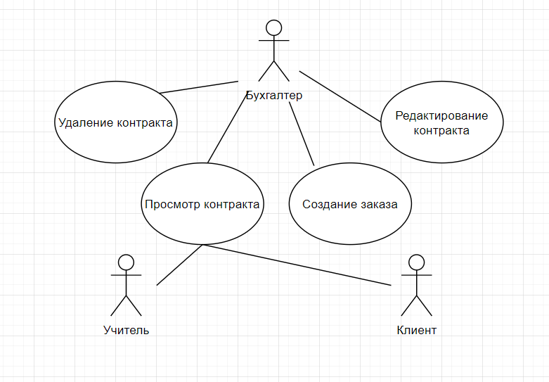
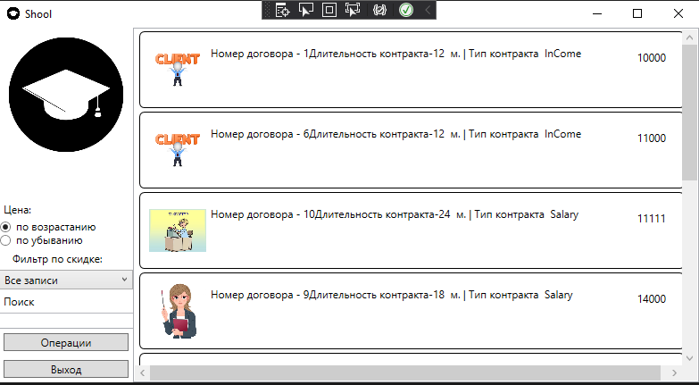

<table style="width: 100%;">
  <tr>
    <td style="text-align: center; border: none;"> 
        Министерство образования и науки РФ <br/>
        ГБПОУ РМЭ "Йошкар-Олинский Технологический колледж 
    </td>
  </tr>
  <tr>
    <td style="text-align: center; border: none; height: 45em;">
        <h2>
            Курсовой проект <br/>
            "Проектирование и разработка информационных систем" <br/>
            для группы И-31
        <h2>
    </td>
  </tr>
  <tr>
    <td style="text-align: right; border: none; height: 20em;">
        <div style="float: right;" align="left">
            <b>Разработал</b>: <br/>
           Логинов Михаил Алексеевич <br/>
            <b>Проверил</b>: <br/>
            Колесников Евгений Иванович
        </div>
    </td>
  </tr>
  <tr>
    <td style="text-align: center; border: none; height: 1em;">
        г.Йошкар-Ола, 2021
    </td>
  </tr>
</table>

<div style="page-break-after: always;"></div>

https://github.com/m0l0des/M_Kurs_Shool
  
  
# Содержание

* [Теоретическая часть](#Теоретическая-часть)


# Теоретическая-часть
## Диаграммы

### Предметная область  Фитнес-центр.Подсистема работы с сотрудниками.

### Диаграмма Use Case:




### Диаграмма ER:


# Практическая часть
## Программирование С#


### Приложение было разработанно в Visual Studio, пример работы программы:
### Главное окно:

#### Прмер кода разметки страницы:
  <Grid>
        <Grid.ColumnDefinitions>
            <ColumnDefinition Width="150"/>
            <ColumnDefinition Width="1*"/>
        </Grid.ColumnDefinitions>
        <StackPanel VerticalAlignment="Bottom">
            <Label Content="Цена: " Height="25"/>
            <RadioButton 
                GroupName="Price"
                Tag="1"
                Content="по возрастанию" 
                IsChecked="True" 
                Checked="RadioButton_Checked"
                VerticalContentAlignment="Center"/>
            <RadioButton 
                GroupName="Price" 
                Tag="2"
                Content="по убыванию" 
                Checked="RadioButton_Checked"
                VerticalContentAlignment="Center"/>
<Label Content="Фильтр по скидке: "
        Margin="10,0,0,0"
        VerticalAlignment="Center"/>
            <ComboBox
    Name="DiscountFilterComboBox"
    SelectedIndex="0"
    SelectionChanged="DiscountFilterComboBox_SelectionChanged"
    ItemsSource="{Binding FilterByDiscountNamesList}"/>
            <Label Content="Поиск"/>
            <TextBox
                    x:Name="SearchFilterTextBox"
                    Width="250"
                    KeyUp="TextBox_KeyUp"
                    VerticalAlignment="Center"
                    />

            <Button Margin="5" x:Name="OrderProvid" Content="Операции" Click="OrdProvidClick"/>
            <Button Margin="5" x:Name="ExitBtn" Content="Выход" Click="ExitButtonClick"/>
        </StackPanel>
        <Image 
        Margin="5"
        Source="/Logo/Logo.png" 
        VerticalAlignment="Top"/>
        <ListView
            Grid.Row="1"
            Grid.Column="1"
            ItemsSource="{Binding ContractList}"
            x:Name="ProductListView" SelectionChanged="ProductListView_SelectionChanged">
            <ListView.ItemContainerStyle>
                <Style 
                    TargetType="ListViewItem">
                    <Setter 
                        Property="HorizontalContentAlignment"
                        Value="Stretch" />
                </Style>
            </ListView.ItemContainerStyle>
            <ListView.ItemTemplate>
                <DataTemplate>
                    <!-- рисуем вокруг элемента границу с загругленными углами -->
                    <Border 
                BorderThickness="1" 
                BorderBrush="Black" 
                CornerRadius="5">
                        <!-- основная "сетка" из 3-х столбцов: картинка, содержимое, цена -->
                        <Grid 
                    Margin="10" 
                    HorizontalAlignment="Stretch">
                            <Grid.ColumnDefinitions>
                                <ColumnDefinition Width="64"/>
                                <ColumnDefinition Width="*"/>
                                <ColumnDefinition Width="100"/>
                            </Grid.ColumnDefinitions>
                            <Image
                        Width="64" 
                        Height="64"
                        Source="{Binding Path=ImagePreview}" />
                            <TextBlock 
                        Text="{Binding Summa}" 
                        Grid.Column="2" 
                        HorizontalAlignment="Right" 
                        Margin="10"/>
                            <!-- для содержимого рисуем вложенную сетку -->
                            <Grid Grid.Column="1" Margin="5">
                                <Grid.RowDefinitions>
                                    <RowDefinition Height="20"/>
                                    <RowDefinition Height="20"/>
                                    <RowDefinition Height="*"/>
                                </Grid.RowDefinitions>
                                <StackPanel
                            Orientation="Horizontal">
                                    <TextBlock 
                                Text="Номер договора - "/>
                                    <TextBlock 
                                Text="{Binding NumberContract}"/>
                                    <TextBlock 
                                Text="Длительность контракта-"/>
                                    <TextBlock 
                                Text="{Binding ContactTime}"/>
                                    <TextBlock 
                                Text="  м. | Тип контракта  "/>
                                    <TextBlock
                                Text="{Binding ContractType.Title}"/>
                                </StackPanel>
                            </Grid>
                        </Grid>
                    </Border>
                </DataTemplate>
            </ListView.ItemTemplate>
        </ListView>
    </Grid>
</Window>
#### Пример Логики главной страницы:

```cs
namespace M_Kurs_Shool
{
    public partial class Contract
    {
        // ссылка на картинку
        // по ТЗ, если картинка не найдена, то должна выводиться картинка по-умолчанию
        // в XAML-е можно это сделать средствами разметки, но там есть условие что вместо ссылки на картинку получен NULL
        // у нас же возможна ситуация, когда в базе есть путь к картинке, но самой картинки в каталоге нет
        // поэтому я сделал проверку наличия файла картинки и возвращаю картинку по-умолчанию, если нужной нет 
        public Uri ImagePreview
        {
            get
            {
                var imageName = System.IO.Path.Combine(Environment.CurrentDirectory, Avatat ?? "");
                return System.IO.File.Exists(imageName) ? new Uri(imageName) : new Uri("pack://application:,,,/img/picture.png");
            }
        }
        public float DiscountFloat
        {
            get
            {
                return Convert.ToSingle(Summa ?? 0);
            }
        }
    }
    /// <summary>
    /// Логика взаимодействия для MainWindow.xaml
    /// </summary>
    public partial class MainWindow : Window, INotifyPropertyChanged
    {

        private List<Contract> _ContractList;
        public event PropertyChangedEventHandler PropertyChanged;
        public List<Contract> ContractList
        {
            get
            {
                var FilteredServiceList = _ContractList.FindAll(item =>
                item.DiscountFloat >= CurrentDiscountFilter.Item1 &&
              item.DiscountFloat < CurrentDiscountFilter.Item2);


                if (SortPriceAscending)
                    return FilteredServiceList.OrderBy(item => (item.Summa)).ToList();
                else
                    return FilteredServiceList.OrderByDescending(item => (item.Summa)).ToList();
            }
            set
            {
                _ContractList = value;
            }
        }

        public MainWindow()
        {
            InitializeComponent();
            this.DataContext = this;
            ContractList = Core.DB.Contract.ToList();
        }

        private void ExitButtonClick(object sender, RoutedEventArgs e)
        {
            Application.Current.Shutdown();
        }
        private void OrdProvidClick(object sender, RoutedEventArgs e)
        {
            var ord = new window.Change();
            ord.ShowDialog();
        }

        private void SearchFilterTextBox_TextChanged(object sender, TextChangedEventArgs e)
        {

        }
        private Boolean _SortPriceAscending = true;
        public Boolean SortPriceAscending
        {
            get { return _SortPriceAscending; }
            set
            {
                _SortPriceAscending = value;
                if (PropertyChanged != null)
                {
                    PropertyChanged(this, new PropertyChangedEventArgs("ContractList"));
                }

            }

        }
        private void RadioButton_Checked(object sender, RoutedEventArgs e)
        {
            SortPriceAscending = (sender as RadioButton).Tag.ToString() == "1";
        }
        private string _SearchFilter = "";
        public string SearchFilter
        {
            get { return _SearchFilter; }
            set
            {
                _SearchFilter = value;
                if (PropertyChanged != null)
                {
                    // при изменении фильтра список перерисовывается
                    PropertyChanged(this, new PropertyChangedEventArgs("ContractList"));

                }
            }
        }

        private void TextBox_KeyUp(object sender, KeyEventArgs e)
        {
            SearchFilter = SearchFilterTextBox.Text;
        }
        private Tuple<float, float> _CurrentDiscountFilter = Tuple.Create(float.MinValue, float.MaxValue);

        public Tuple<float, float> CurrentDiscountFilter
        {
            get
            {
                return _CurrentDiscountFilter;
            }
            set
            {
                _CurrentDiscountFilter = value;
                if (PropertyChanged != null)
                {
                    // при изменении фильтра список перерисовывается
                    PropertyChanged(this, new PropertyChangedEventArgs("ContractList"));
                }
            }
        }

        public List<string> FilterByDiscountNamesList
        {
            get
            {
                return FilterByDiscountValuesList
                    .Select(item => item.Item1)
                    .ToList();
            }
        }

        private List<Tuple<string, float, float>> FilterByDiscountValuesList =
          new List<Tuple<string, float, float>>() {
        Tuple.Create("Все записи", 0f, 30000f),
        Tuple.Create("от 10000 до 12000", 10000f, 12000f),
        Tuple.Create("от 13000 до 15000", 13000f, 15000f),
        Tuple.Create("от 16000 до 17000", 16000f, 17000f),
        Tuple.Create("от 18000 до 20000", 18000f, 20000f)
    }; private void DiscountFilterComboBox_SelectionChanged(object sender, SelectionChangedEventArgs e)
        {
            CurrentDiscountFilter = Tuple.Create(
                FilterByDiscountValuesList[DiscountFilterComboBox.SelectedIndex].Item2,
                FilterByDiscountValuesList[DiscountFilterComboBox.SelectedIndex].Item3
            );
        }


    }

}
```

### Окно заказов:

#### Прмер кода разметки страницы заказов:
```xml
 <Grid>
        <Grid.ColumnDefinitions>
            <ColumnDefinition Width="150"/>
            <ColumnDefinition Width="1*"/>
        </Grid.ColumnDefinitions>

        <StackPanel VerticalAlignment="Bottom">
            <Button Margin="5" x:Name="CreateOrdBtn" Content="Создание заказа" Click="AddOrder_Click"></Button>
            <Button Margin="5" x:Name="EditOrdBtn" Content="Изменение Заказа" Click="EditOrder_Click"></Button>
            <Button Margin="5" x:Name="DelOrdBtn" Content="Удаление Заказа" Click="DelOrd_Click"></Button>
        </StackPanel>

        <ListView
            Grid.Row="1"
            Grid.Column="1"
            ItemsSource="{Binding ChangeList}"
            x:Name="ProductListView">
            <ListView.ItemContainerStyle>
                <Style 
                    TargetType="ListViewItem">
                    <Setter 
                        Property="HorizontalContentAlignment"
                        Value="Stretch" />
                </Style>
            </ListView.ItemContainerStyle>
            <ListView.ItemTemplate>
                <DataTemplate>
                    <!-- рисуем вокруг элемента границу с загругленными углами -->
                    <Border 
                BorderThickness="1" 
                BorderBrush="Black" 
                CornerRadius="5">
                        <!-- основная "сетка" из 3-х столбцов: картинка, содержимое, цена -->
                        <Grid 
                    Margin="10" 
                    HorizontalAlignment="Stretch">
                            <Grid.ColumnDefinitions>
                                <ColumnDefinition Width="64"/>
                                <ColumnDefinition Width="*"/>
                                <ColumnDefinition Width="100"/>
                            </Grid.ColumnDefinitions>

                            <Image
                        Width="64" 
                        Height="64"
                        Source="{Binding Client.ImagePre}" />
                            <!-- ,TargetNullValue={StaticResource DefaultImage} -->

                        

       

                            <!-- для содержимого рисуем вложенную сетку -->
                            <Grid Grid.Column="1" Margin="5">
                                <Grid.RowDefinitions>
                                    <RowDefinition Height="20"/>
                                    <RowDefinition Height="20"/>
                                    <RowDefinition Height="*"/>
                                </Grid.RowDefinitions>

                                <StackPanel
                            Orientation="Horizontal">
                                    <TextBlock 
                                Text="{Binding Client.LastName}"/>
                                    <TextBlock 
                                Text="  "/>
                                    <TextBlock 
                                Text="{Binding Client.FirstName}"/>
                                    <TextBlock 
                                Text="  "/>
                                    <TextBlock 
                                Text="{Binding Client.Patronymic}"/>
                                    <TextBlock 
                                Text="  "/>
                                    <TextBlock 
                                Text="{Binding Client.Role}"/>
                                    <TextBlock 
                                Text=" | "/>
                                    <TextBlock 
                                Text="{Binding ContractType.Title}"/>
                                </StackPanel>

                                <TextBlock 
                            Text="{Binding Summa}" 
                            Grid.Row="1"/>
                            </Grid>
                        </Grid>
                    </Border>
                </DataTemplate>
            </ListView.ItemTemplate>
        </ListView>
    </Grid>
</Window>
```
#### Пример Логики страницы заказов:

```cs
namespace M_Kurs_Shool
{
    public partial class Client
    {
        
        // ссылка на картинку
        // по ТЗ, если картинка не найдена, то должна выводиться картинка по-умолчанию
        // в XAML-е можно это сделать средствами разметки, но там есть условие что вместо ссылки на картинку получен NULL
        // у нас же возможна ситуация, когда в базе есть путь к картинке, но самой картинки в каталоге нет
        // поэтому я сделал проверку наличия файла картинки и возвращаю картинку по-умолчанию, если нужной нет 
        public Uri ImagePre
        {
            get
            {
                var imageName = System.IO.Path.Combine(Environment.CurrentDirectory, Img ?? "");
                return System.IO.File.Exists(imageName) ? new Uri(imageName) : new Uri("pack://application:,,,/img/picture.png");
            }
        }
    }
}
namespace M_Kurs_Shool.window
{

    /// <summary>
    /// Логика взаимодействия для order.xaml
    /// </summary>
    public partial class Change : Window, INotifyPropertyChanged
    {
        private List<Contract> _ChangeList;
        public event PropertyChangedEventHandler PropertyChanged;
        public List<Contract> ChangeList
        {
            get
            {
                return _ChangeList;
            }
            set
            {
                _ChangeList = value;
                if (PropertyChanged != null)
                {

                    PropertyChanged(this, new PropertyChangedEventArgs("ChangeList"));
                }
            }
        }


        public Change()
        {
            InitializeComponent();
            this.DataContext = this;
            ChangeList = Core.DB.Contract.ToList();
        }
        private void DelOrd_Click(object sender, RoutedEventArgs e)
        {
            var item = ProductListView.SelectedItem as Contract;
            Core.DB.Contract.Remove(item);
            Core.DB.SaveChanges();
            ChangeList = Core.DB.Contract.ToList();
        }

        private void EditOrder_Click(object sender, RoutedEventArgs e)
        {
            var SelectedService = ProductListView.SelectedItem as Contract;
            var EditServiceWindow = new window.Add (SelectedService);
            if ((bool)EditServiceWindow.ShowDialog())
            {
                // при успешном завершении не забываем перерисовать список услуг
                PropertyChanged(this, new PropertyChangedEventArgs("ChangeList"));
                // и еще счетчики - их добавьте сами
            }
        }
        private void AddOrder_Click(object sender, RoutedEventArgs e)
        {
            //  создаем новую услугу
            var NewService = new Contract();

            var NewServiceWindow = new Add (NewService);
            if ((bool)NewServiceWindow.ShowDialog())
            {
                //список услуг нужно перечитать с сервера
                ChangeList = Core.DB.Contract.ToList();

                PropertyChanged(this, new PropertyChangedEventArgs("ChangeList"));
            }
        }
    }
}
```
### Окно добавления и редактирования заказов:


#### Прмер кода разметки страницы редактирования заказов:
```xml
  <Grid>
        <Grid.ColumnDefinitions>
            <ColumnDefinition Width="auto"/>
            <ColumnDefinition  Width="*"/>
        </Grid.ColumnDefinitions>

        <StackPanel Grid.Column="1" Orientation="Horizontal" Visibility="{Binding NewProduct}">
            <Label Content="Идентификатор услуги: "/>
            <Label Content="{Binding CurrentAdd.Id}"/>
        </StackPanel>


        <StackPanel Margin="5 60" Grid.Column="1">
            <ComboBox
                HorizontalAlignment="left"
                ItemsSource="{Binding ClientList}"
                SelectedItem="{Binding CurrentAdd.Client}">
                <ComboBox.ItemTemplate>
                    <DataTemplate>
                        <Label Content="{Binding FullName}"/>
                    </DataTemplate>
                </ComboBox.ItemTemplate>
            </ComboBox>

            <Label Content="Тип данных"/>
            <TextBox Text="{Binding CurrentAdd.ContactTypeId}"/>
            <Label Content="Сумма контракта"/>
            <TextBox Text="{Binding CurrentAdd.Summa}"/>

            <Button Width="100" Margin="5" HorizontalAlignment="Left" Click="SaveButton_Click">Сохранить</Button>
        </StackPanel>
    </Grid>
</Window>

    ```
#### Пример Логики страницы редактирования заказов:

```cs
namespace M_Kurs_Shool
{
    public partial class Client
    {

        public string FullName
        {
            get
            {
                return FirstName + LastName + Patronymic;
            }
        }
    }
}
namespace M_Kurs_Shool.window
{

    /// <summary>
    /// Логика взаимодействия для Add.xaml
    /// </summary>
    public partial class Add : Window, INotifyPropertyChanged
    {

        public List<Client> ClientList { get; set; }

        public Add(Contract contract)
        {
            InitializeComponent();
            this.DataContext = this;
            CurrentAdd = contract;
            ClientList = Core.DB.Client.ToList();

        }

        public event PropertyChangedEventHandler PropertyChanged;
        public Contract CurrentAdd { get; set; }
        public string WindowName
        {
            get
            {
                return CurrentAdd.id == 0 ? "Новая услуга" : "Редоктирование улсгуи";
            }
        }


        private void SaveButton_Click(object sender, RoutedEventArgs e)
        {


            {
                if (CurrentAdd.id == 0)
                    Core.DB.Contract.Add(CurrentAdd);


                try
                {
                    Core.DB.SaveChanges();
                }
                catch
                {
                }
                DialogResult = true;
            }


        }

        public string NewProduct
        {
            get
            {
                if (CurrentAdd.id == 0) return "collapsed";
                return "visible";


            }
        }
    }
}

```
# Тестировние
## Создание библиотеки классов и Юнит тестов
### Библиотека классов
```cs
namespace ClassLibrary1
{
    public class Analytics
    {

        public Boolean CheckRole(int ContactTypeId)
        {
            if (ContactTypeId <= 1)
            {
                return false;
            }
            else
                return true;
        }


        public string RoleNotNull(int price)
        {
            if (price <= 0)
            {
                return "Роль не может быть меньше или равна нулю!!!";
            }
            else
                return "Всё правильно";
        }
    }
}


```
### Юнит тесты 

```cs
namespace UnitTestProject1
{
    [TestClass]
    public class UnitTestProject1
    {
        static Analytics disk_price;
        [ClassInitialize]
        static public void Init(TestContext tc)
        {
            disk_price = new Analytics();
        }


        //Проверка на размер Роли
        [TestMethod]
        public void CheckRole()
        {
            Assert.IsTrue(disk_price.CheckRole(2));
        }

        //Проверка на нулевую Роль
        [TestMethod]
        public void RoleNotNull()
        {
            Assert.AreEqual(disk_price.RoleNotNull(-12), "Роль не может быть меньше или равна нулю!!!");
        }
    }
}
```
## Пример работы юнит тестов:

